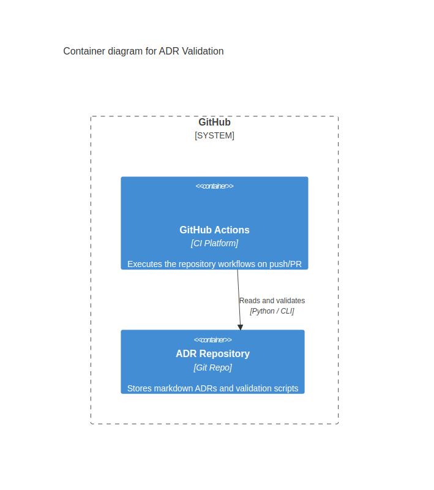

# 2. Add Automation using GitHub Actions

Date: 2026-03-24

## Status

Proposed

## Context

We need to decide on a system to run CI/CD workflows and specifically the scripts that validate our Architecture Decision Records (ADRs). Since we are heavily leveraging GitHub for our repository hosting and issue tracking, integrating with its native automation tooling makes sense.

We have defined `github` and `github_actions` in our `software_systems.yaml`. This provides a controlled namespace when creating container diagrams of our continuous integration pipelines.

## Container Diagram

Here is a C4 diagram illustrating the relationships:

## Decision

We will use **GitHub Actions** exclusively to run CI workloads related to our ADR validations and Mermaid image generation.

## Consequences

- We can use shared action templates provided by GitHub.
- Diagram visualizations are embedded via compiled PNGs so they are easy to read anywhere without mermaid renderer support.
