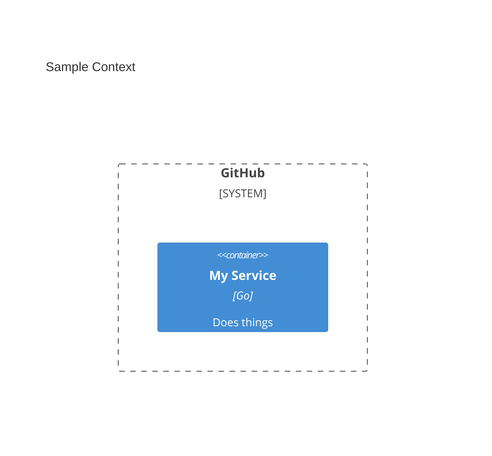

# Architecture Decision Records (ADR) Guide

Welcome to the ADR repository! We use a strict system to maintain architecture records alongside their corresponding C4 diagrams.

## How to Create a New ADR

When you're ready to document a new architectural decision, follow this workflow:

### 1. Check Software Systems

Before making a diagram, ensure the highest-level systems you will interact with are defined in the `software_systems.yaml` file located at the root of the repository.

- Look for the `id` of the system you want to represent (e.g. `github`).
- If a system doesn't exist, propose adding it to the YAML file.

### 2. Write the C4 Diagram (.mmd)

We preserve Mermaid source code in standalone `.mmd` files to ensure they can be safely compiled without corrupting markdown records.

Create a new file for your ADR diagram. **We strongly encourage creating subfolders for each Domain/System** to keep ADRs logically grouped (e.g., `docs/adr/authentication/000X-your-decision-diagram.mmd`). Our validation scripts and Github Actions fully support deeply nested structures.

Define your containers:
- **Important**: Your containers **must** be wrapped inside a `System_Boundary`.
- **CRITICAL**: The ID provided to the `System_Boundary` MUST be a valid ID from the `software_systems.yaml`.

Example:


### 3. Write the ADR Document (.md)

Create your ADR markdown file `docs/adr/000X-your-decision.md`. We recommend standard ADR formats.

To reference the diagram, write a standard markdown image syntax pointing to the `.png` counterpart of your `.mmd` file. (Even if the `.png` isn't generated yet!).

```markdown

```

### 4. Validate Locally (Optional)

You can run the validation script locally to ensure your syntax correctly maps to the allowed system identifiers:
```bash
python3 scripts/validate_mermaid_systems.py
```

### 5. Push Context and Auto-Generation

Simply open a Pull Request!
- `validate-adr.yml` will run on your PR, verifying the integrity of your `System_Boundary` references against the source-of-truth configuration.
- Once merged to `main`, the `generate-diagrams.yml` action will trigger, parse the new `.mmd` file using `@mermaid-js/mermaid-cli`, create the `000X-your-decision-diagram.png` file, and commit it directly back to your repository. 

Your ADR will now automatically display the latest C4 architecture diagram inline!
