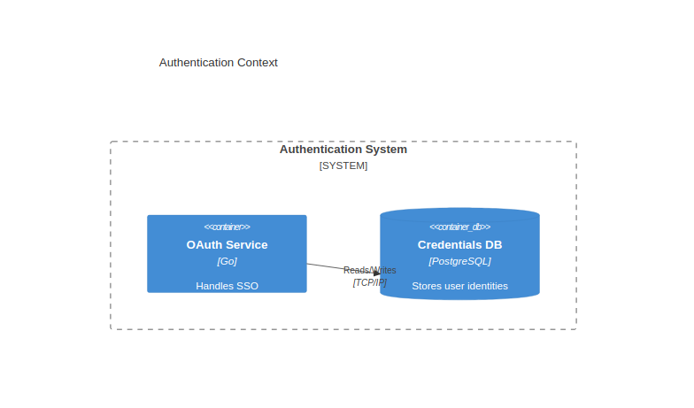

# 3. Microservice Auth

Date: 2026-03-24

## Status

Proposed

## Context

We need an authentication service for our new domain architecture. By dropping this ADR into `docs/adr/authentication/`, we group all ADRs logically per software system / domain!

## Container Diagram

Here is a C4 diagram illustrating the relationships:

## Decision

We will use Go and PostgreSQL for the OAuth service.
